# Java Collection Framework

## Что такое Java Collections Framework? 
Java Collections Framework - это библиотека встроенная в JDK (Java Development Kit) в пакете java.util, 
которая создана для того, чтобы разработчик мог использовать готовые классы и интерфейсы 
для работы с наборами однородных объектов Java
## Из чего состоит Java Collection Framework?
- ### Java Collection Framework можно представить иерархией интерфейсов и классов
    - 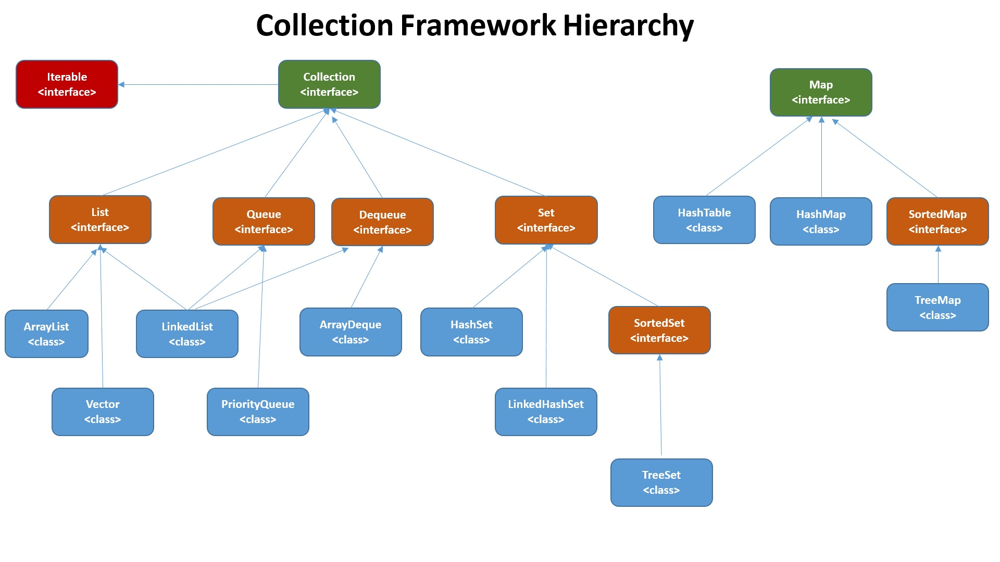
- ### Интерфейс Iterable
    - Методы:
    - 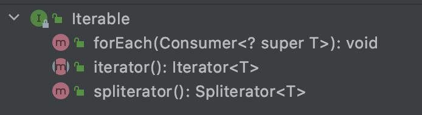
- ### Интерфейс Collection
    - Наследует интерфейс Iterable
    - Методы:
    - 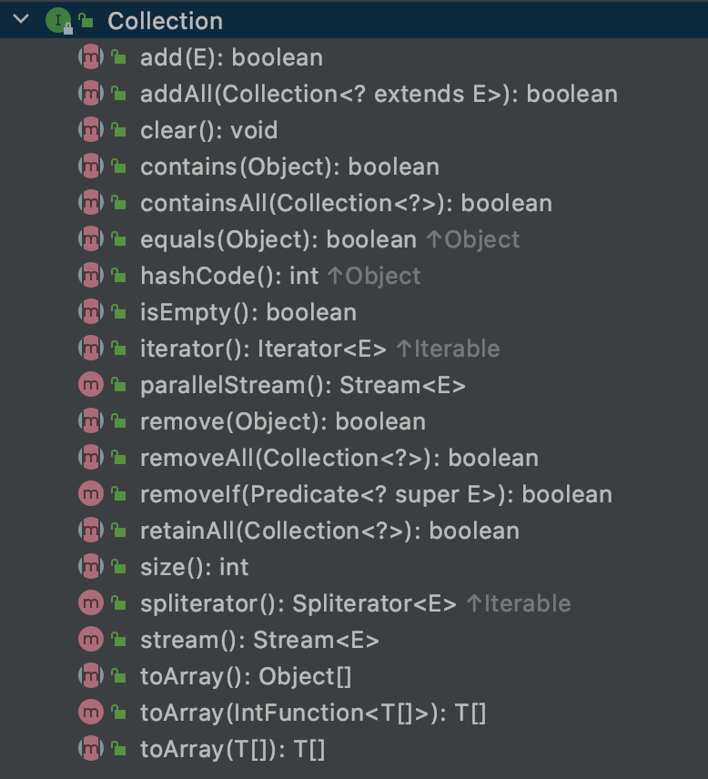
- ### Интерфейс List
    - List (список) представляет собой коллекцию, в которой допустимы дублирующие значения. 
    Элементы такой коллекции пронумерованы, начиная от нуля, к ним можно обратиться по индексу
    - Наследует интерфейс Collection
    - Методы:
    - 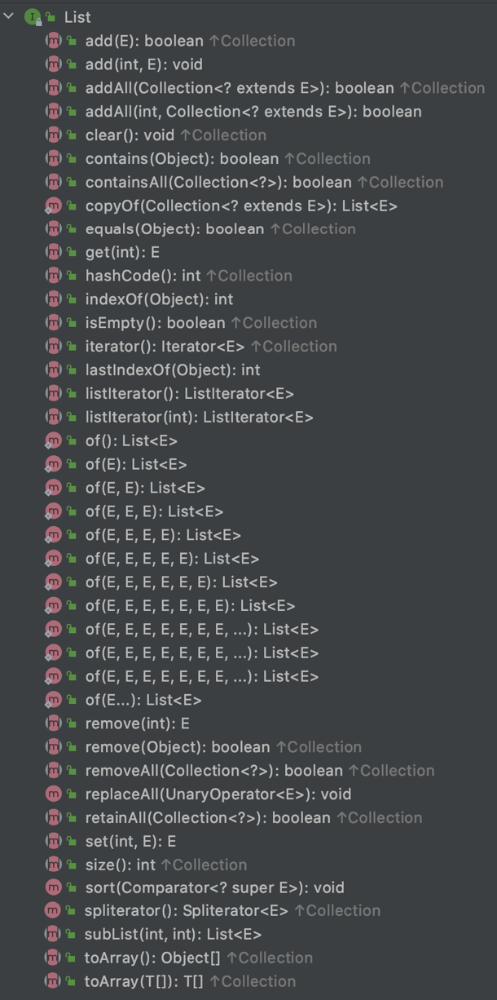
    - Интерфейс List реализован классами:
        - ArrayList - инкапсулирует в себе обычный массив, длина которого автоматически увеличивается 
        при добавлении новых элементов.
        - LinkedList (двунаправленный связный список) - состоит из узлов, каждый из которых содержит 
        как собственно данные, так и две ссылки на следующий и предыдущий узел
        - Vector — реализация динамического массива объектов, методы которой синхронизированы
        - Stack — реализация стека LIFO (last-in-first-out)
- ### Интерфейс Set
    - Set (сет) описывает неупорядоченную коллекцию, не содержащую повторяющихся элементов
    - Наследует интерфейс Collection
    - Методы:
    - 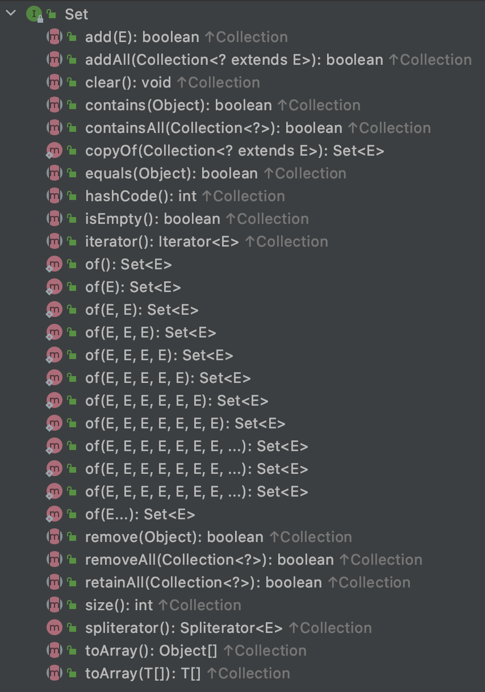
    - Интерфейс Set реализован классами:
        - HashSet - использует HashMap для хранения данных. В качестве ключа и значения используется 
        добавляемый элемент. Из-за особенностей реализации порядок элементов не гарантируется при добавлении.
        - LinkedHashSet — гарантирует, что порядок элементов при обходе коллекции будет идентичен порядку добавления элементов.
        - EnumSet - это специализированная коллекция Set для работы с enum классами. Может содержать только enum 
        значения и все значения должны принадлежать к тому же enum. Не позволяет добавлять null значения
- ### Интерфейс SortedSet
    - Наследует интерфейс Set, который наследует интерфейс Collection
    - Методы:
    - 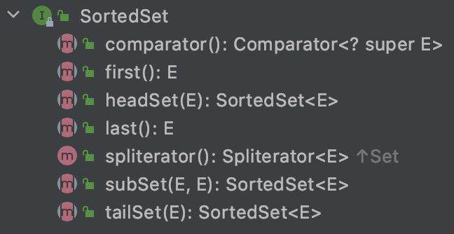  
    - Интерфейс SortedSet реализован классами:
        - TreeSet — предоставляет возможность управлять порядком элементов в коллекции 
        при помощи объекта Comparator, либо сохраняет элементы с использованием «natural ordering»
- ### Интерфейс Queue
    - Queue (очередь) предназначена для хранения элементов с предопределённым способом вставки и извлечения
    - Наследует интерфейс Collection
    - Методы:
    - 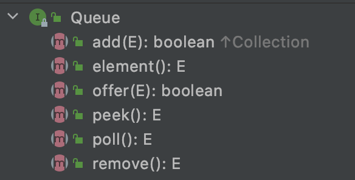
    - Интерфейс Queue реализован классами:
        - PriorityQueue — предоставляет возможность управлять порядком элементов в коллекции 
        при помощи объекта Comparator, либо сохраняет элементы с использованием «natural ordering».
- ### Интерфейс Dequeue
    - Наследует интерфейс Queue
    - Методы:
    - 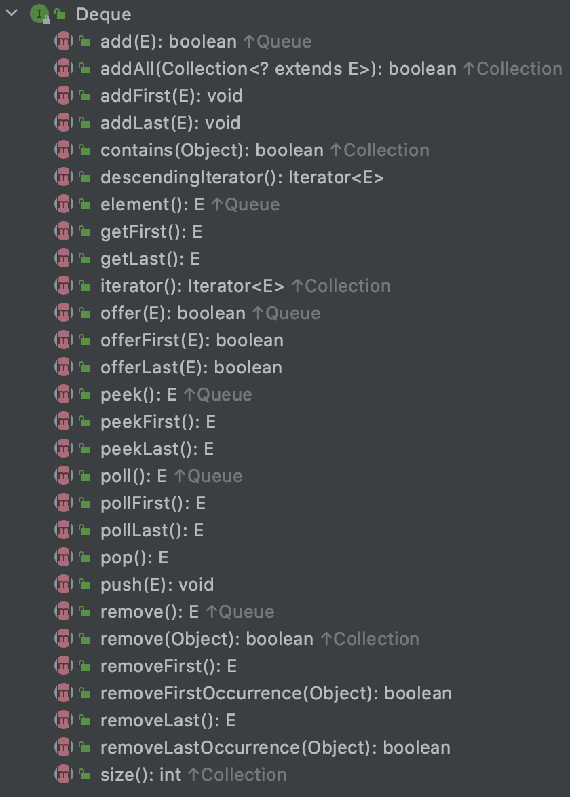
    - Интерфейс Dequeue реализован классами:
        - ArrayDeque — реализация интерфейса Deque, который расширяет интерфейс Queue методами, 
        позволяющими реализовать конструкцию вида LIFO (last-in-first-out)
- ### Интерфейс Map
    - НЕ наследует интерфейс Collection
    - Методы: 
    - 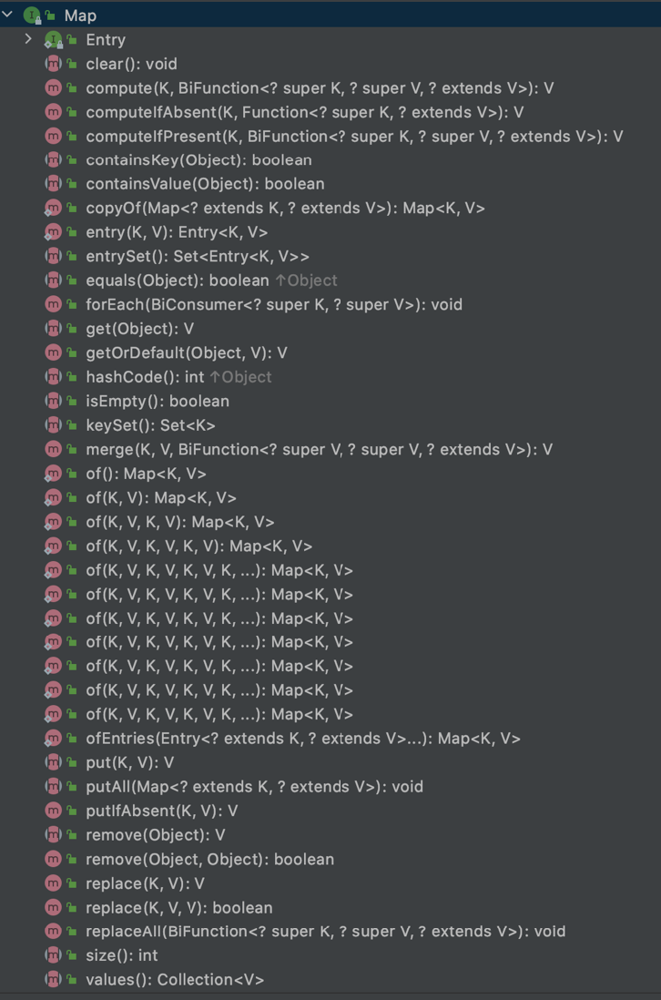
    - Интерфейс Map реализован классами:
        - Hashtable — хэш-таблица, методы которой синхронизированы. Не позволяет использовать null 
        в качестве значения или ключа и не является упорядоченной
        - HashMap — хэш-таблица. Позволяет использовать null в качестве значения или ключа и не является упорядоченной
        - LinkedHashMap — упорядоченная реализация хэш-таблицы.
        - TreeMap — реализация, основанная на красно-чёрных деревьях. 
        Является упорядоченной и предоставляет возможность управлять порядком элементов в коллекции при помощи 
        объекта Comparator, либо сохраняет элементы с использованием «natural ordering»
        - WeakHashMap — реализация хэш-таблицы, которая организована с использованием weak references 
        для ключей (сборщик мусора автоматически удалит элемент из коллекции при следующей сборке мусора, 
        если на ключ этого элемента нет жёстких ссылок)
        
## Что такое вычислительная сложность алгоритма и что такое O-нотация?
Вычислительная сложность - это функция зависимости объёма работы, которая выполняется некоторым алгоритмом, 
от размера входных данных. Объём работы обычно измеряется абстрактными понятиями времени и пространства, 
называемыми вычислительными ресурсами. Когда говорят о сложности алгоритма в терминах О-нотаций, то подразумевают 
асимптотическая сложность алгоритма. Важно отметить, что несмотря на то, что функция временной сложности 
алгоритма в некоторых случаях может быть определена точно, в большинстве случаев искать точное её значение бессмысленно. 
Дело в том, что, во-первых, точное значение временной сложности зависит от определения элементарных 
операций (например, сложность можно измерять в количестве арифметических операций, битовых операций 
или операций на машине Тьюринга), а во-вторых, при увеличении размера входных данных вклад постоянных множителей 
и слагаемых низших порядков, фигурирующих в выражении для точного времени работы, становится крайне незначительным.

- Например, мы можем точно посчитать алгоритмическую сложность T(n) = n + n = 2n
```java
void complexFunction(List list) {
    for (int i = 0; i < list.size; i++) {
	    someComplexLogic_1(); 
    }    for (int j =0; i < list.size; i++){
		someComplexLogic_2(); 
    }
}
```
- Но в терминах O-нотаций это будет O(n) = n

### Шпаргалка по вычислительной сложности в коллекциях
- 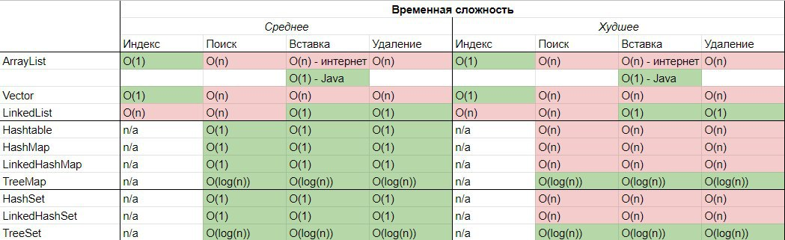

## Что такое Iterator?
Iterator - объект, позволяющий перебирать элементы коллекции. 
Например foreach реализован с использованием итератора. 
Одним из ключевых методов интерфейса Collection является метод Iterator<E> iterator().
Метод Iterator<E> возвращает итератор - то есть объект, реализующий интерфейс Iterator.

## Как между собой связаны Iterable и Iterator и «for-each»?
- Интерфейс Iterable имеет только один метод - iterator(), который возвращает Iterator
- Классы, реализующие интерфейс Iterable, могут применяться в конструкции for-each, которая использует Iterator

## Как работает ArrayList?

### Какие интерфейсы реализует ArrayList?
```java
public class ArrayList<E> extends AbstractList<E>
        implements List<E>, RandomAccess, Cloneable, java.io.Serializable {
...
}
```

### ArrayList работает на простом массиве:
```java
/**
 * The array buffer into which the elements of the ArrayList are stored.
 * The capacity of the ArrayList is the length of this array buffer. Any
 * empty ArrayList with elementData == DEFAULTCAPACITY_EMPTY_ELEMENTDATA
 * will be expanded to DEFAULT_CAPACITY when the first element is added.
 */
transient Object[] elementData; // non-private to simplify nested class access
```

### Почему поле elementData помечено модификатором transient, неужели ArrayList не сериализуется?
ArrayList сериализуется и десериализуется, но пологается он на свой собственный механизм. 
Чтобы убедиться в этом достаточно посмотреть на реализацию методов writeObject() и readObject(). 
Любопытно, что во время сериализации ArrayList не сохраняет пустые значения, а использует параметр своего размера,
чтобы определенить сколько объектов записывать

### Как происходит измерение размера массива elementData? 
```java
/**
 * Increases the capacity to ensure that it can hold at least the
 * number of elements specified by the minimum capacity argument.
 *
 * @param minCapacity the desired minimum capacity
 * @throws OutOfMemoryError if minCapacity is less than zero
 */
private Object[] grow(int minCapacity) {
    return elementData = Arrays.copyOf(elementData,
                                       newCapacity(minCapacity));
}
```

### Происходит ли изменение размера массива быстрее чем O(n)?
Нет 
```java
/**
 * Copies the specified array, truncating or padding with nulls (if necessary)
 * so the copy has the specified length.  For all indices that are
 * valid in both the original array and the copy, the two arrays will
 * contain identical values.  For any indices that are valid in the
 * copy but not the original, the copy will contain {@code null}.
 * Such indices will exist if and only if the specified length
 * is greater than that of the original array.
 * The resulting array is of the class {@code newType}.
 *
 * @param <U> the class of the objects in the original array
 * @param <T> the class of the objects in the returned array
 * @param original the array to be copied
 * @param newLength the length of the copy to be returned
 * @param newType the class of the copy to be returned
 * @return a copy of the original array, truncated or padded with nulls
 *     to obtain the specified length
 * @throws NegativeArraySizeException if {@code newLength} is negative
 * @throws NullPointerException if {@code original} is null
 * @throws ArrayStoreException if an element copied from
 *     {@code original} is not of a runtime type that can be stored in
 *     an array of class {@code newType}
 * @since 1.6
 */
@HotSpotIntrinsicCandidate
public static <T,U> T[] copyOf(U[] original, int newLength, Class<? extends T[]> newType) {
    @SuppressWarnings("unchecked")
    T[] copy = ((Object)newType == (Object)Object[].class)
        ? (T[]) new Object[newLength]
        : (T[]) Array.newInstance(newType.getComponentType(), newLength);
    System.arraycopy(original, 0, copy, 0,
                     Math.min(original.length, newLength));
    return copy;
}
```
Код для проверки того, что работа System.arraycopy зависит от количества элементов в массиве

```java
public class Main {

  public static void main(String[] args) {
    int size = 5000000;
    for (int count = 0; count < 5; count++) {
      size = size * 2;
      long start, end;
      Integer[] integers = new Integer[size];
      Integer[] systemCopy = new Integer[size];

      start = System.currentTimeMillis();
      System.arraycopy(integers, 0, systemCopy, 0, size);
      end = System.currentTimeMillis();
      System.out.println(end - start);
    }
  }
}
```

### Какая размерность массива ArrayList по умолчанию? 
```java
/**
 * Default initial capacity.
 */
private static final int DEFAULT_CAPACITY = 10;
```

### Как уменьшить размер ArrayList?
Существует специальный метод, для того, чтобы оптимизировать размер ArrayList. Это может понадобится разработчику, например, когда
в ArrayList было сначала добавлено много элементов, а потом много удалено
```java
/**
 * Trims the capacity of this {@code ArrayList} instance to be the
 * list's current size.  An application can use this operation to minimize
 * the storage of an {@code ArrayList} instance.
 */
public void trimToSize() {
    modCount++;
    if (size < elementData.length) {
        elementData = (size == 0)
          ? EMPTY_ELEMENTDATA
          : Arrays.copyOf(elementData, size);
    }
}
```

## Как работает HashMap?

У класса Object есть два важных метода hashCode() и equals(Object obj), которые используются для корректной работы HashMap. 
Ключ, по которому кладется значение в HashMap, должен обязательно наследоваться от Object, следовательно, 
примитивные типы не могут быть ключами в HashMap.
Оба метода и hashCode() и equals(Object obj) вызываются у ключа, после того, как был вызван метод put(key, value). 

```java
/**
 * Returns a hash code value for the object. This method is
 * supported for the benefit of hash tables such as those provided by
 * {@link java.util.HashMap}.
 * <p>
 * The general contract of {@code hashCode} is:
 * <ul>
 * <li>Whenever it is invoked on the same object more than once during
 *     an execution of a Java application, the {@code hashCode} method
 *     must consistently return the same integer, provided no information
 *     used in {@code equals} comparisons on the object is modified.
 *     This integer need not remain consistent from one execution of an
 *     application to another execution of the same application.
 * <li>If two objects are equal according to the {@code equals(Object)}
 *     method, then calling the {@code hashCode} method on each of
 *     the two objects must produce the same integer result.
 * <li>It is <em>not</em> required that if two objects are unequal
 *     according to the {@link java.lang.Object#equals(java.lang.Object)}
 *     method, then calling the {@code hashCode} method on each of the
 *     two objects must produce distinct integer results.  However, the
 *     programmer should be aware that producing distinct integer results
 *     for unequal objects may improve the performance of hash tables.
 * </ul>
 * <p>
 * As much as is reasonably practical, the hashCode method defined
 * by class {@code Object} does return distinct integers for
 * distinct objects. (The hashCode may or may not be implemented
 * as some function of an object's memory address at some point
 * in time.)
 *
 * @return  a hash code value for this object.
 * @see     java.lang.Object#equals(java.lang.Object)
 * @see     java.lang.System#identityHashCode
 */
@HotSpotIntrinsicCandidate
public native int hashCode();

/**
 * Indicates whether some other object is "equal to" this one.
 * <p>
 * The {@code equals} method implements an equivalence relation
 * on non-null object references:
 * <ul>
 * <li>It is <i>reflexive</i>: for any non-null reference value
 *     {@code x}, {@code x.equals(x)} should return
 *     {@code true}.
 * <li>It is <i>symmetric</i>: for any non-null reference values
 *     {@code x} and {@code y}, {@code x.equals(y)}
 *     should return {@code true} if and only if
 *     {@code y.equals(x)} returns {@code true}.
 * <li>It is <i>transitive</i>: for any non-null reference values
 *     {@code x}, {@code y}, and {@code z}, if
 *     {@code x.equals(y)} returns {@code true} and
 *     {@code y.equals(z)} returns {@code true}, then
 *     {@code x.equals(z)} should return {@code true}.
 * <li>It is <i>consistent</i>: for any non-null reference values
 *     {@code x} and {@code y}, multiple invocations of
 *     {@code x.equals(y)} consistently return {@code true}
 *     or consistently return {@code false}, provided no
 *     information used in {@code equals} comparisons on the
 *     objects is modified.
 * <li>For any non-null reference value {@code x},
 *     {@code x.equals(null)} should return {@code false}.
 * </ul>
 * <p>
 * The {@code equals} method for class {@code Object} implements
 * the most discriminating possible equivalence relation on objects;
 * that is, for any non-null reference values {@code x} and
 * {@code y}, this method returns {@code true} if and only
 * if {@code x} and {@code y} refer to the same object
 * ({@code x == y} has the value {@code true}).
 * <p>
 * Note that it is generally necessary to override the {@code hashCode}
 * method whenever this method is overridden, so as to maintain the
 * general contract for the {@code hashCode} method, which states
 * that equal objects must have equal hash codes.
 *
 * @param   obj   the reference object with which to compare.
 * @return  {@code true} if this object is the same as the obj
 *          argument; {@code false} otherwise.
 * @see     #hashCode()
 * @see     java.util.HashMap
 */
public boolean equals(Object obj) {
    return (this == obj);
}
```

Когда мы помещаем пару ключ/значение в HashMap, то HashMap вычисляет хеш от ключа, вызывая метод hashCode() у ключа. 

```java
/**
 * Computes key.hashCode() and spreads (XORs) higher bits of hash
 * to lower.  Because the table uses power-of-two masking, sets of
 * hashes that vary only in bits above the current mask will
 * always collide. (Among known examples are sets of Float keys
 * holding consecutive whole numbers in small tables.)  So we
 * apply a transform that spreads the impact of higher bits
 * downward. There is a tradeoff between speed, utility, and
 * quality of bit-spreading. Because many common sets of hashes
 * are already reasonably distributed (so don't benefit from
 * spreading), and because we use trees to handle large sets of
 * collisions in bins, we just XOR some shifted bits in the
 * cheapest possible way to reduce systematic lossage, as well as
 * to incorporate impact of the highest bits that would otherwise
 * never be used in index calculations because of table bounds.
 */
static final int hash(Object key) {
    int h;
    return (key == null) ? 0 : (h = key.hashCode()) ^ (h >>> 16);
}
```

Вычисленное значение hashCode берется по модулю от количества bucket'ов в HashMap и помещается по номеру вычисленной позиции
в нужный bucket.

```java
/**
 * The table, initialized on first use, and resized as
 * necessary. When allocated, length is always a power of two.
 * (We also tolerate length zero in some operations to allow
 * bootstrapping mechanics that are currently not needed.)
 */
transient Node<K,V>[] table;
```

Если в bucket`е по вычисленной позицией уже имеются другие пары ключ/значение, тогда HashMap пробегается по списку объектов 
и сравнивает ключ с уже лежащими ключами с помощью метода equals(Object obj).

### Какая размерность HashMap по умолчанию?

```java
/**
 * The default initial capacity - MUST be a power of two.
 */
static final int DEFAULT_INITIAL_CAPACITY = 1 << 4; // aka 16

### Как и когда происходит увеличение количества корзин в HashMap?

Помимо capacity у HashMap есть еще поле loadFactor, на основании которого, вычисляется предельное количество занятых корзин capacity * loadFactor. По умолчанию loadFactor = 0.75. По достижению предельного значения, число корзин увеличивается в 2 раза и для всех хранимых элементов вычисляется новое «местоположение» с учетом нового числа корзин.

```

## Когда и какую коллекцию применять?

## В чем разница между классами java.util.Collection и java.util.Collections?
- java.util.Collections - набор статических методов для работы с коллекциями
- java.util.Collection - один из основных интерфейсов Java Collections Framework

## Как отсортировать коллекцию?

Сортировать коллекции можно многими способами. Зачастую самый простой использовать статические методы sort() в классах 
Collections или Arrays. Также в List есть метод sort(), который вызовет статический метод sort() в классе Arrays.
Важно понимать, что порядок сортировки объекта нужно явно задать либо c помощью имплементации интерфейса Comparable 
в самом классе объекта, коллекцию которых мы хотим сортировать, либо с помощью реализации функционального интерфейса 
Comparator и передачи его в качестве параметра.  

## Как устроены деревья?
- 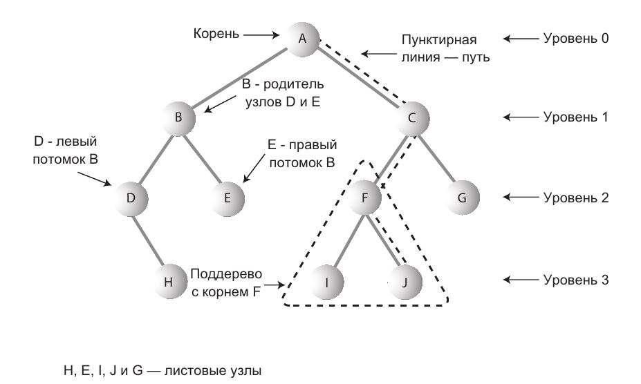

## Что такое балансировка в дереве?

Балансировка - это процесс перестроения дерева, при котором удается получить примерно одинаковое количество узлов
до листьев и любой проход вниз до листьев будет содержать примерно одинаковое количество элементов.
Дерево считается сбалансированным если имеет примерно одинаковое количество 
элементов относительно корня в каждой его ветке. 
Если дерево сбалансированное, то операции с ним будут выполняться быстрее.

## Почему нельзя использовать byte[] в качестве ключа в HashMap?

Хэш-код массива не зависит от хранимых в нем элементов, а присваивается при создании массива 
(метод вычисления хэш-кода массива не переопределен и вычисляется по стандартному Object.hashCode() на основании адреса 
массива). Так же у массивов не переопределен equals и выполняется сравнение указателей. 
Это приводит к тому, что обратиться к сохраненному с ключом-массивом элементу не получится при использовании другого 
массива такого же размера и с такими же элементами, доступ можно осуществить лишь в одном случае — при использовании 
той же самой ссылки на массив, что использовалась для сохранения элемента.


