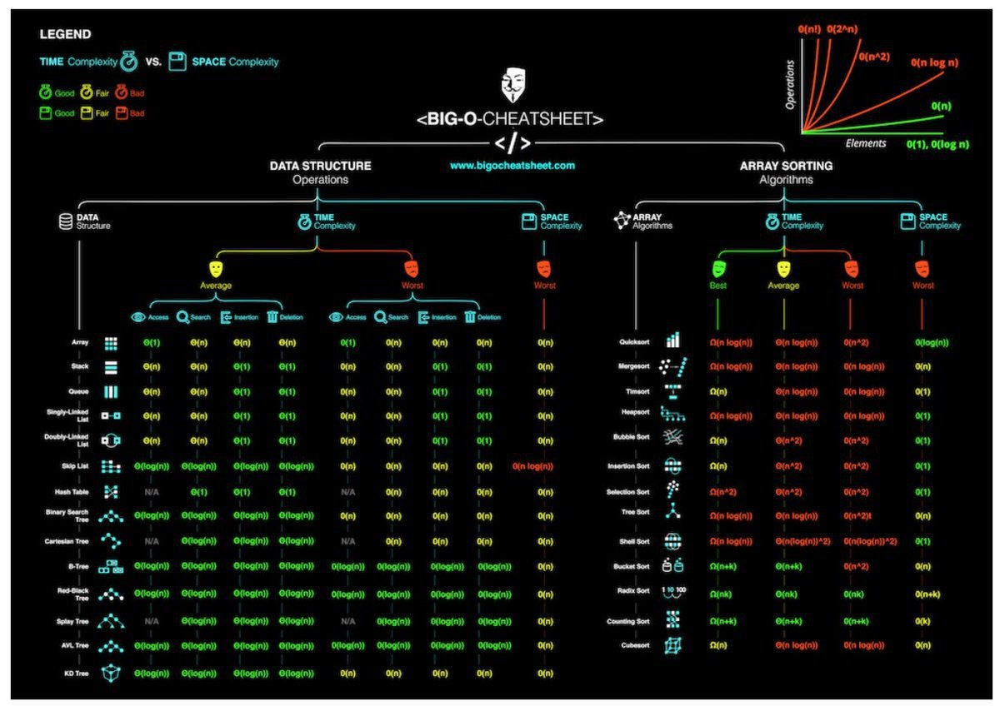

# Java Collection Framework

## Что такое Java Collections Framework? 
Java Collections Framework - это библиотека встроенная в JDK (Java Development Kit), 
которая создана для того, чтобы разработчик мог использовать готовые классы и интерфейсы 
для работы с наборами объектов Java
## Из чего состоит Java Collection Framework?
- Java Collection Framework можно представить иерархией интерфейсов и классов
- #### Интерфейс Collection
    - 
    - Наследует интерфейс Iterable
    - Методы:
    - 
- #### Интерфейс List
    - List (список) представляет собой коллекцию, в которой допустимы дублирующие значения. 
    Элементы такой коллекции пронумерованы, начиная от нуля, к ним можно обратиться по индексу
    - Наследует интерфейс Collection
    - Методы:
    - 
    - Интерфейс List реализован классами:
        - ArrayList - инкапсулирует в себе обычный массив, длина которого автоматически увеличивается 
        при добавлении новых элементов.
        - LinkedList (двунаправленный связный список) - состоит из узлов, каждый из которых содержит 
        как собственно данные, так и две ссылки на следующий и предыдущий узел
        - Vector — реализация динамического массива объектов, методы которой синхронизированы
        - Stack — реализация стека LIFO (last-in-first-out)
- #### Интерфейс Set
    - Set (сет) описывает неупорядоченную коллекцию, не содержащую повторяющихся элементов
    - Наследует интерфейс Collection
    - Методы:
    - 
    - Интерфейс Set реализован классами:
        - HashSet - использует HashMap для хранения данных. В качестве ключа и значения используется 
        добавляемый элемент. Из-за особенностей реализации порядок элементов не гарантируется при добавлении.
        - LinkedHashSet — гарантирует, что порядок элементов при обходе коллекции будет идентичен порядку добавления элементов.
- #### Интерфейс SortedSet
    - Наследует интерфейс Set, который наследует интерфейс Collection
    - Методы:
    -   
    - Интерфейс SortedSet реализован классами:
        - TreeSet — предоставляет возможность управлять порядком элементов в коллекции 
        при помощи объекта Comparator, либо сохраняет элементы с использованием «natural ordering»
- #### Интерфейс Queue
    - Queue (очередь) предназначена для хранения элементов с предопределённым способом вставки и извлечения
    - Наследует интерфейс Collection
    - Методы:
    - 
    - Интерфейс Queue реализован классами:
        - PriorityQueue — предоставляет возможность управлять порядком элементов в коллекции 
        при помощи объекта Comparator, либо сохраняет элементы с использованием «natural ordering».
- #### Интерфейс Dequeue
    - Наследует интерфейс Collection
    - Методы:
    - 
    - Интерфейс Dequeue реализован классами:
        - ArrayDeque — реализация интерфейса Deque, который расширяет интерфейс Queue методами, 
        позволяющими реализовать конструкцию вида LIFO (last-in-first-out)
- #### Интерфейс Map
    - НЕ наследует интерфейс Collection
    - Методы: 
    - 
    - Интерфейс Map реализован классами:
        - Hashtable — хэш-таблица, методы которой синхронизированы. Не позволяет использовать null 
        в качестве значения или ключа и не является упорядоченной
        - HashMap — хэш-таблица. Позволяет использовать null в качестве значения или ключа и не является упорядоченной
        - LinkedHashMap — упорядоченная реализация хэш-таблицы.
        - TreeMap — реализация, основанная на красно-чёрных деревьях. 
        Является упорядоченной и предоставляет возможность управлять порядком элементов в коллекции при помощи 
        объекта Comparator, либо сохраняет элементы с использованием «natural ordering»
        - WeakHashMap — реализация хэш-таблицы, которая организована с использованием weak references 
        для ключей (сборщик мусора автоматически удалит элемент из коллекции при следующей сборке мусора, 
        если на ключ этого элемента нет жёстких ссылок)
        
## Что такое вычислительная сложность алгоритма и что такое O-нотация?
Вычислительная сложность - это функция зависимости объёма работы, которая выполняется некоторым алгоритмом, 
от размера входных данных. Объём работы обычно измеряется абстрактными понятиями времени и пространства, 
называемыми вычислительными ресурсами. Когда говорят о сложности алгоритма в терминах О-нотаций, то подразумевают 
асимптотическая сложность алгоритма. Важно отметить, что несмотря на то, что функция временной сложности 
алгоритма в некоторых случаях может быть определена точно, в большинстве случаев искать точное её значение бессмысленно. 
Дело в том, что во-первых, точное значение временной сложности зависит от определения элементарных 
операций (например, сложность можно измерять в количестве арифметических операций, битовых операций 
или операций на машине Тьюринга), а во-вторых, при увеличении размера входных данных вклад постоянных множителей 
и слагаемых низших порядков, фигурирующих в выражении для точного времени работы, становится крайне незначительным.

#### Шпаргалка по вычислительной сложности в коллекциях
- 

## Как работает ArrayList?

#### Какие интерфейсы реализует ArrayList?
```java
public class ArrayList<E> extends AbstractList<E>
        implements List<E>, RandomAccess, Cloneable, java.io.Serializable {
...
}
```

#### ArrayList работает на простом массиве:
```java
/**
 * The array buffer into which the elements of the ArrayList are stored.
 * The capacity of the ArrayList is the length of this array buffer. Any
 * empty ArrayList with elementData == DEFAULTCAPACITY_EMPTY_ELEMENTDATA
 * will be expanded to DEFAULT_CAPACITY when the first element is added.
 */
transient Object[] elementData; // non-private to simplify nested class access
```

#### Почему поле elementData помечено модификатором transient, неужели ArrayList не сериализуется?
ArrayList сериализуется и десериализуется, но пологается он на свой собственный механизм. 
Чтобы убедиться в этом достаточно посмотреть на реализацию методов writeObject() и readObject(). 
Любопытно, что во время сериализации ArrayList не сохраняет пустые значения, а использует параметр своего размера,
чтобы определенить сколько объектов записывать

#### Как происходит измерение размера массива elementData? 
```java
/**
 * Increases the capacity to ensure that it can hold at least the
 * number of elements specified by the minimum capacity argument.
 *
 * @param minCapacity the desired minimum capacity
 * @throws OutOfMemoryError if minCapacity is less than zero
 */
private Object[] grow(int minCapacity) {
    return elementData = Arrays.copyOf(elementData,
                                       newCapacity(minCapacity));
}
```

#### Почему изменение размера массива происходит быстрее чем O(n)? 
```java
/**
 * Copies the specified array, truncating or padding with nulls (if necessary)
 * so the copy has the specified length.  For all indices that are
 * valid in both the original array and the copy, the two arrays will
 * contain identical values.  For any indices that are valid in the
 * copy but not the original, the copy will contain {@code null}.
 * Such indices will exist if and only if the specified length
 * is greater than that of the original array.
 * The resulting array is of the class {@code newType}.
 *
 * @param <U> the class of the objects in the original array
 * @param <T> the class of the objects in the returned array
 * @param original the array to be copied
 * @param newLength the length of the copy to be returned
 * @param newType the class of the copy to be returned
 * @return a copy of the original array, truncated or padded with nulls
 *     to obtain the specified length
 * @throws NegativeArraySizeException if {@code newLength} is negative
 * @throws NullPointerException if {@code original} is null
 * @throws ArrayStoreException if an element copied from
 *     {@code original} is not of a runtime type that can be stored in
 *     an array of class {@code newType}
 * @since 1.6
 */
@HotSpotIntrinsicCandidate
public static <T,U> T[] copyOf(U[] original, int newLength, Class<? extends T[]> newType) {
    @SuppressWarnings("unchecked")
    T[] copy = ((Object)newType == (Object)Object[].class)
        ? (T[]) new Object[newLength]
        : (T[]) Array.newInstance(newType.getComponentType(), newLength);
    System.arraycopy(original, 0, copy, 0,
                     Math.min(original.length, newLength));
    return copy;
}
```

#### Какая размерность массива ArrayList по умолчанию?
```java
/**
 * Default initial capacity.
 */
private static final int DEFAULT_CAPACITY = 10;
```

#### Как уменьшить размер ArrayList?
Существует специальный метод, для того, чтобы оптимизировать размер ArrayList, например когда
было добавлено много элементов, а потом много удалено
```java
/**
 * Trims the capacity of this {@code ArrayList} instance to be the
 * list's current size.  An application can use this operation to minimize
 * the storage of an {@code ArrayList} instance.
 */
public void trimToSize() {
    modCount++;
    if (size < elementData.length) {
        elementData = (size == 0)
          ? EMPTY_ELEMENTDATA
          : Arrays.copyOf(elementData, size);
    }
}
```

## Как работает HashMap?

## Когда и какую коллекцию применять?

## В чем разница между классами java.util.Collection и java.util.Collections?
- java.util.Collections - набор статических методов для работы с коллекциями
- java.util.Collection - один из основных интерфейсов Java Collections Framework

## Как между собой связаны Iterable и Iterator и «for-each»?
- Интерфейс Iterable имеет только один метод - iterator(), который возвращает Iterator
- Классы, реализующие интерфейс Iterable, могут применяться в конструкции for-each, которая использует Iterator.
  